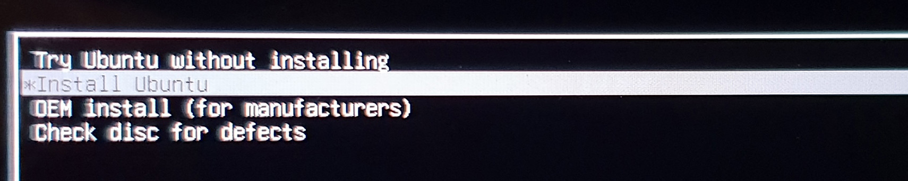
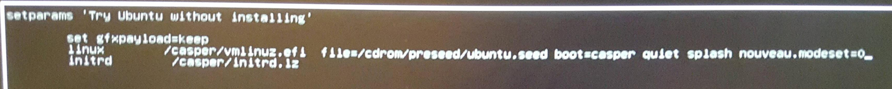
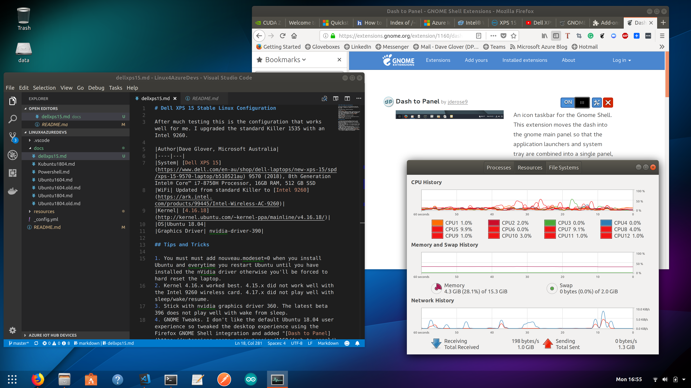

# Dell XPS 15 Stable Linux Configuration

After much testing this is the configuration that works well for me, most importantly wake from sleep worked consistently well.

| Author          | Dave Glover, Microsoft Australia |
| --------------- | ------- |
| Date            | 2 July 2018                                                                                                                                                                                             |
| System          | [Dell XPS 15](https://www.dell.com/en-au/shop/dell-laptops/new-xps-15/spd/xps-15-9570-laptop/b510521au) 9570 (2018), 8th Generation Intel® Core™ i7-8750H Processor, 16GB RAM, 512 GB SSD               |
| WiFi            | I [upgraded](https://www.youtube.com/watch?v=hAKpjfc2hs8&t=146s) the standard Killer 1535 with an [Intel 9260]((https://ark.intel.com/products/99445/Intel-Wireless-AC-9260)) wireless/bluetooth module |
| Kernel          | [4.16.18](http://kernel.ubuntu.com/~kernel-ppa/mainline/v4.16.18/)                                                                                                                                      |
| OS              | Ubuntu 18.04                                                                                                                                                                                            |
<!-- TOC -->

- [Dell XPS 15 Stable Linux Configuration](#dell-xps-15-stable-linux-configuration)
    - [Tips and Tricks for Dell XPS 15 9570 (2018 Model)](#tips-and-tricks-for-dell-xps-15-9570-2018-model)
        - [Update BIOS](#update-bios)
        - [Reboot tip](#reboot-tip)
    - [Update GRUB](#update-grub)
    - [Update the Linux Kernel](#update-the-linux-kernel)
        - [Uninstalling a kernel](#uninstalling-a-kernel)
    - [Update nVidia Driver](#update-nvidia-driver)
    - [GNOME Tweaks](#gnome-tweaks)
    - [Increase swap file size](#increase-swap-file-size)
    - [Enable Touchpad Right Click](#enable-touchpad-right-click)
    - [Cool Apps I install](#cool-apps-i-install)

<!-- /TOC -->

## Tips and Tricks for Dell XPS 15 9570 (2018 Model)

### Update BIOS

1. From BIOS Setup
    1. Change disk from RAID to AHCI. This will cause the Windows Partition to fail. Search the web for tricks to resolve. I personally decided to reinstall Windows as it seemed to be a robust solution than various tricks I read.
    2. Disable secure boot
    3. [Experience setting up Ubuntu 18.04 on Dell XPS 15 9570](https://medium.com/@peterpang_84917/personal-experience-of-installing-ubuntu-18-04-lts-on-xps-15-9570-3e53b6cfeefe)

### Reboot tip

2. **You must must add nouveau.modeset=0 when you install Ubuntu and every time you restart Ubuntu until you have installed the nVidia driver otherwise you'll be forced to hard reset the laptop.**
    1. Boot Ubuntu 18.04 from USB
    2. Cursor to "Install Ubuntu"
    
    3. Press 'e' to edit
    4. Edit line starting with 'linux', add nouveau.modeset=0 after the word 'splash'
    
    5. Install Ubuntu as you would normally
    6. Press F10 to install Ubuntu (remember when restarting to add nouveau.modeset=0).

## Update GRUB

```bash
sudo nano /etc/default/grub
```

modify line start with GRUB_CMDLINE_LINUX_DEFAULT and add "acpi_rev_override=1 acpi_osi=Linux" to the end.

the line should look like the following.

GRUB_CMDLINE_LINUX_DEFAULT="quiet splash acpi_rev_override=1 acpi_osi=Linux nouveau.modeset=0"

save and exit nano

Update GRUB

```bash
sudo update-grub
```

## Update the Linux Kernel

4. Kernel 4.16.x worked best. 4.15.x did not work well with the Intel 9260 wireless card. 4.17.x did not play well with sleep/wake/resume.
    1. See [How to Install Kernel 4.16 in Ubuntu / Linux Mint](http://ubuntuhandbook.org/index.php/2018/04/install-kernel-4-16-ubuntu-linux-mint/)
    2. Download Linux Kernel [4.16.18](http://kernel.ubuntu.com/~kernel-ppa/mainline/v4.16.18/)
        1. Download the following files
            1. linux-headers-4.16.18-041618_4.16.18-041618.201806252030_all.deb
            2. linux-headers-4.16.18-041618-generic_4.16.18-041618.201806252030_amd64.deb
            3. linux-image-unsigned-4.16.18-041618-generic_4.16.18-041618.201806252030_amd64.deb
            4. linux-modules-4.16.18-041618-generic_4.16.18-041618.201806252030_amd64.deb
        2. Install with sudo dpkg -i *.deb
        3. Reboot

### Uninstalling a kernel

    1. Boot system to alternate kernel
    2. From terminal

        ```bash
        sudo dpkg --purge linux-headers-<version>-generic
        sudo dpkg --purge linux-headers-<version>
        sudo dpkg --purge linux-image-unsigned-<version>
        sudo dpkg --purge linux-modules-<version>-generic
        ```

## Update nVidia Driver

5. Stick with nvidia graphics driver 360. The latest beta 396 does not play well with wake from sleep. See [Install Latest NVIDIA Drivers In Linux](http://www.linuxandubuntu.com/home/how-to-install-latest-nvidia-drivers-in-linux). In summary:-

    1. sudo add-apt-repository ppa:graphics-drivers
    2. sudo apt update
    3. Software and Drivers -> Additional Drivers -> nvidia-driver-390

6. edit the GRUB config file and remove nouveau.modeset=0 and rebuild GRUB

## GNOME Tweaks

7. GNOME Tweaks. I don't like the default Debian/Ubuntu 18.04 user experience so tweaked the desktop experience using the Firefox GNOME Shell integration and added "[Dash to Panel](https://extensions.gnome.org/extension/1160/dash-to-panel/)". It is similar to Windows 10 user experience.

    

## Increase swap file size

7. Increase virtual memory. On this system not so necessary, but your system will become unstable if it runs out of virtual memory. Follow these [instructions](https://askubuntu.com/questions/927854/how-do-i-increase-the-size-of-swapfile-without-removing-it-in-the-terminal) to increase the swap file.

## Enable Touchpad Right Click

8. Enable Right mouse click on touchpad. See [No secondary button (right click) on touchpad](https://askubuntu.com/questions/1028776/no-secondary-button-right-click-on-touchpad)

    ```bash
    gsettings set org.gnome.desktop.peripherals.touchpad click-method areas
    ```

## Cool Apps I install

1. Sticky Notes

- [How Install Sticky Notes in Ubuntu](https://www.bettertechtips.com/ubuntu/install-sticky-notes-ubuntu/)
- [5 Cool Sticky Notes Apps for Ubuntu](https://www.bettertechtips.com/ubuntu/sticky-notes-ubuntu/)
